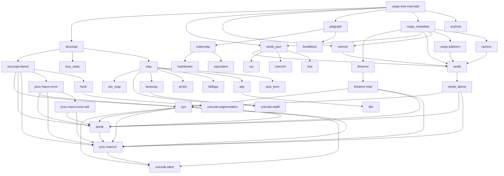

# Cargo-tree-mermaid

## Introduction

This is a small POC implementation to generate a Mermaid Tree on the Cargo file. 

The implementation is based on the project https://github.com/sfackler/cargo-tree

Feel free to copy, reuse or build it out, I needed only a short output on the console for my case.

## Sample

